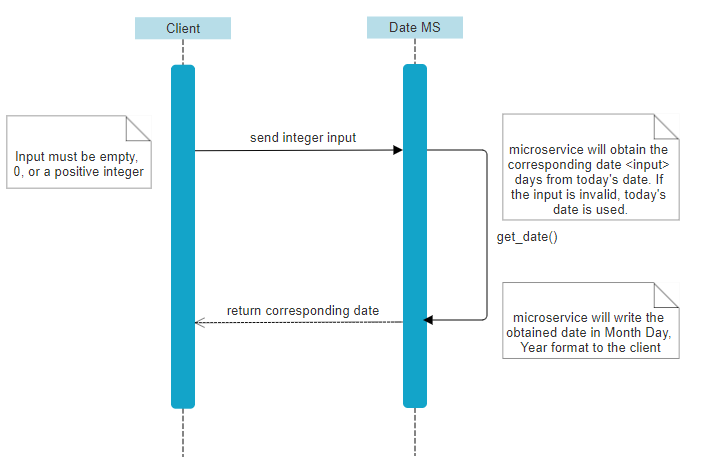

DATE MICROSERVICE FOR MATH WORKSHEET GENERATOR 
WRITTEN BY: NGOC-THAO LY

IMPORTS 
Python Sockets Module 
Datetime Module 

INSTRUCTIONS/COMMUNICATION CONTRACT 
Run the client and the microservice in two separate terminals to establish a connection. 
---Enter <py \date_ms.py> in terminal 1 
---Enter <py \date_client.py> in terminal 2

To Request Data: 
Input any 0 or positive integer value in the client and press enter. 
---Assume today's date is May 14, 2024 
---Enter <2> in the client

To Receive Data: 
You will automatically receive the corresponding date in MONTH DAY, YEAR format. 
---You will receive <May 16, 2024> in the client

To Close: 
Enter "exit" in the client input to close both the client and the microservice. 
---Enter <exit> in the client 
---Both the client and server will close

UML SEQUENCE DIAGRAM 

LIMITATIONS 
The date microservice only handles single client connections.

CREDITS 
The client and server code are based off of the following tutorial-- 
https://www.datacamp.com/tutorial/a-complete-guide-to-socket-programming-in-python
